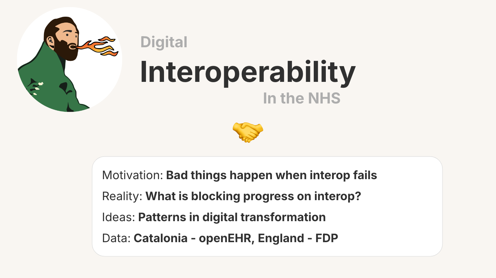
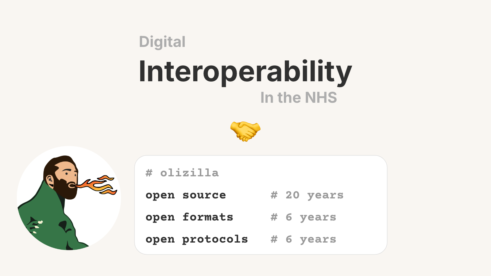

# Digital Interop in the NHS

I’m going to talk about digital interop in the NHS, starting with my motivation:
- the bad things that happen when it fails
- The realities of what is holding up progress
- Some ideas from academia on patterns of nation scale digital transformation.
- And then look at work that is happening here and in Catalonia.

To declare my biases up front
I believe open source code, open data formats and open digital protocols are the essential ingredients for interoperability.
My credentials:
- I’ve been and open source software engineer for 20 years.
- I’ve spent 6 years working on open data formats and protocols to bring the magic of content addressing to the web.
And for the last 2 years I’ve been studying a Masters of Public Administration focusing on collaboration, governance, economics and public value.
…and it’s where I built the Digital Public Infrastructure map with the team at UCL IIPP

---

_Original Deck: [docs.google.com/presentation/d/1p-vwbdQgK_wU4Lzj75cWnt5rxd60FQexiFR76XqP5Mg](https://docs.google.com/presentation/d/1p-vwbdQgK_wU4Lzj75cWnt5rxd60FQexiFR76XqP5Mg/edit)_

_Published: 2026-05-28_
